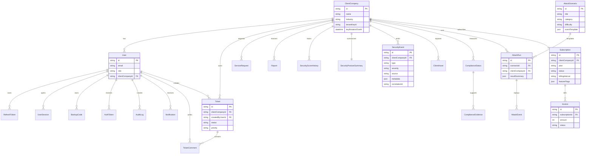

# ERD

```mermaid
erDiagram
  ClientCompany ||--o{ User : has
  ClientCompany ||--o{ Ticket : owns
  ClientCompany ||--o{ ServiceRequest : requests
  ClientCompany ||--o{ Report : receives
  ClientCompany ||--o{ SecurityScoreHistory : tracks
  ClientCompany ||--|| SecurityPostureSummary : summarizes
  ClientCompany ||--o{ SecurityEvent : emits
  ClientCompany ||--o{ ClientAsset : exposes
  ClientCompany ||--o{ ComplianceStatus : measures
  ClientCompany ||--o{ AttackRun : runs
  ClientCompany ||--|| Subscription : subscribes

  User ||--o{ RefreshToken : owns
  User ||--o{ UserSession : opens
  User ||--o{ BackupCode : owns
  User ||--o{ AuthToken : receives
  User ||--o{ AuditLog : creates
  User ||--o{ Notification : receives
  User ||--o{ TicketComment : writes
  User ||--o{ Ticket : creates

  Ticket ||--o{ TicketComment : contains
  Subscription ||--o{ Invoice : bills
  ComplianceStatus ||--o{ ComplianceEvidence : supports
  AttackScenario ||--o{ AttackRun : templates
  AttackRun ||--o{ AttackEvent : replays

  ClientCompany {
    string id PK
    string name
    string industry
    string tenantKeyId
    datetime keyRotationDueAt
  }
  User {
    string id PK
    string email
    string role
    string clientCompanyId FK
  }
  Ticket {
    string id PK
    string clientCompanyId FK
    string createdByUserId FK
    string status
    string priority
  }
  SecurityEvent {
    string id PK
    string clientCompanyId FK
    string type
    string severity
    string source
    json metadata
    string correlationId
  }
  AttackScenario {
    string id PK
    string title
    string category
    string difficulty
    json eventTemplate
  }
  AttackRun {
    string id PK
    string scenarioId FK
    string clientCompanyId FK
    json resultSummary
  }
  Subscription {
    string id PK
    string clientCompanyId FK
    string plan
    string status
    string billingInterval
    json featureFlags
  }
  Invoice {
    string id PK
    string subscriptionId FK
    int amount
    string status
  }
```
